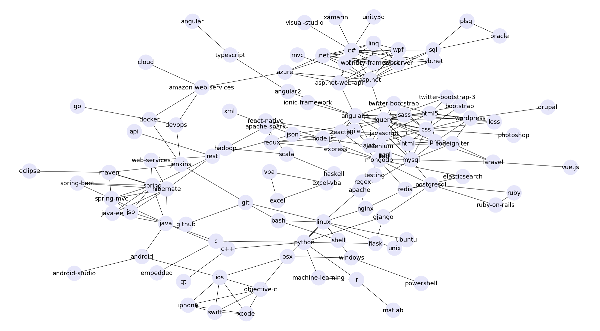

# Graph_clustering

### Graph
 

### Work Flow
Graph created ---> Embedding generated ---> Clustered using embedding ---> Clusters Visualized

### Tools used: 

#### Node2vec: 
Graph generation : Networkx 
Embedding generation : Node2vec 
Clustering : HDBSCAN 
Dimension Reduction : UMAP 

#### GraphSAGE: 
Graph generation : StellerGraph 
Embedding generation : GraphSAGE 
Clustering : HDBSCAN 
Dimension Reduction : PCA 

#### Agglomerative: 
Graph generation : Networkx 
Clustering : Agglomerative hierarchical clustering  
